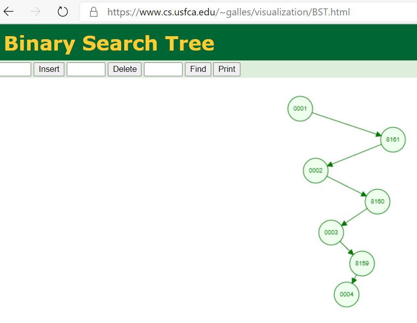

# 1649. Create Sorted Array through Instructions

https://leetcode.com/problems/create-sorted-array-through-instructions/

## Notes

If the result of the already executed instructions was kept in a
collection that is ordered and supports random access, then it's
very easy to determine a new instruction's cost with a binary
search.

The collection also has to be insertion-effective, as we're
constantly inserting while executing new instructions. So an array
is not suitable.

Before thinking about Binary Search Tree, check out the starting instructions of one of the
test case from LeetCode, and its visualization. It's deliberately
designed to result in an unbalanced tree:

    $ head test-case-100000.json
    [1,
    81615,
    2,
    81614,
    3,
    81613,
    4,
    81612,
    5,
    81611,

Although I managed to solve it by introducing an index on an array,
a Fenwick tree or binary indexed tree is superior to my index. It
is the data structure born for this problem.

Say we're going to sum `[0,435)` using my index, the break down will
be:

    [0,435) = [0,100) + [100,200) + [200,300) + [300,400)
             + [400,410) + [410,420) + [420,430)
             + [430] + [431] + [432] + [433] + [434]

It's decimal style. While on the other hand, Fenwick tree "is based on the fact that all positive
integers can be represented as the sum of powers of 2. For example 19 can be
represented as 16 + 2 + 1. Every node of the BITree stores the sum of n
elements where n is a power of 2 [[1]](https://www.geeksforgeeks.org/binary-indexed-tree-or-fenwick-tree-2/)."