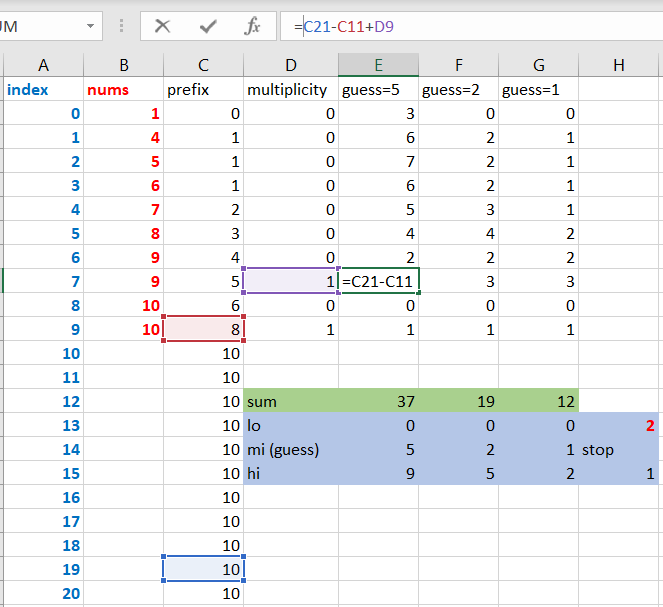

# 719. Find K-th Smallest Pair Distance

https://leetcode.com/problems/find-k-th-smallest-pair-distance/

## Notes

I should definitely revisit this problem someday. The LeetCode official
solutions are mind-blowing.

An Excel sheet was created to help myself understand the solution #2:

(Updated 2021-02-16) The reason I was so amazed by the binary search approach a month ago
was that back then I was only familiar with the idea of applying binary search on an
*obvious* collection, and didn't have the sense to turn a search space into an ordered collection.
