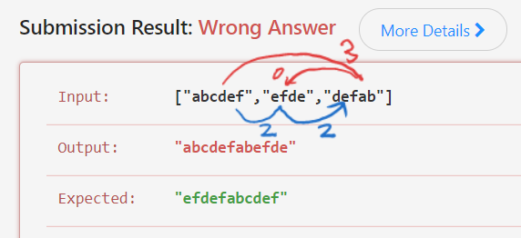
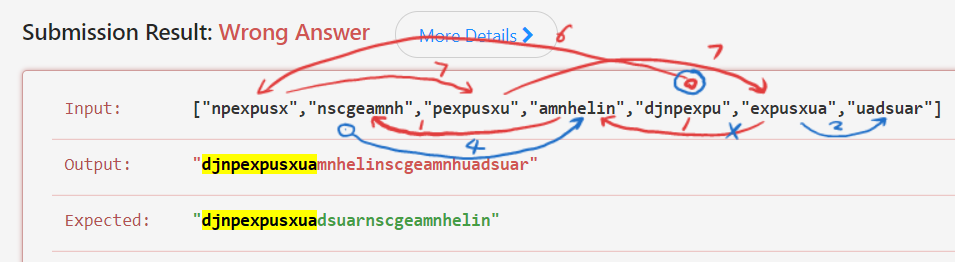
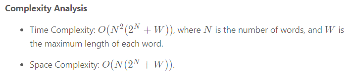

# 943. Find the Shortest Superstring

[https://leetcode.com/problems/find-the-shortest-superstring/](https://leetcode.com/problems/find-the-shortest-superstring/)

## Greedy Does Not Work!

Greedy approach is incorrect. Consider this:

## There Is a Directed Graph

Define `edge[i, j] = overlapLen(words[i], words[j])`.

Then the task is identical to traverse the graph in a way that maximize edge
summary. Although, this didn't say anything about how to solve it.

## Core Idea

Compute and compare the scores of *ALL* the DFS paths.

The time and space complexity required for this problem is horrible:

(Given by https://leetcode.com/problems/find-the-shortest-superstring/solution/)

From DP's view, a state comprises:

1. the set of consumed words and
2. the last consumed word.

The part 1's space complexity is `O(2^N)` and part 2, `O(N)`.

And for each state, all the remaining words need to be checked before
determining the next state so there is another `O(N)` in the time complexity.

## Implementation Challenge

The state is more complex than average DP problems. It doesn't comprise one, two or
three scalars, it comprises a scalar and a *set*! No wonder the `N` is
constricted to `N <= 20`, and that means the set can fit into an int32.

Another challenge is that it requires the output to be the super string itself,
not just its length. That means the implementation must maintain the DFS path,
which is a vector rather than a scalar. For me back then, it pushed the
difficulty to a whole new level. Because I thought I had to carry the
full-length path all the way during DFS. As I did when solving the [N
Queens](../n_queens_51/Solution_496728871.cpp) problem earlier.

