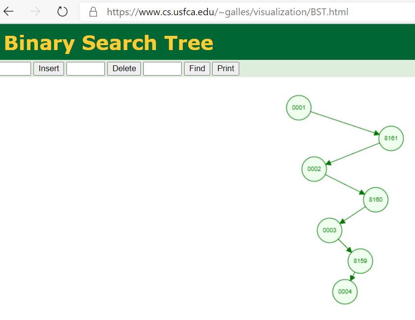

# 1649. Create Sorted Array through Instructions

https://leetcode.com/problems/create-sorted-array-through-instructions/

## Notes

If the result of the already executed instructions was kept in a
collection that is ordered and supports random access, then it's
very easy to determine a new instruction's cost with a binary
search.

The collection also has to be insertion-effective, as we're
constantly inserting while executing new instructions. So an array
is not suitable.

Before thinking about Binary Search Tree, check out the starting instructions of one of the
test case from LeetCode, and its visualization. It's deliberately
designed to result in an unbalanced tree:

    $ head test-case-100000.json
    [1,
    81615,
    2,
    81614,
    3,
    81613,
    4,
    81612,
    5,
    81611,

