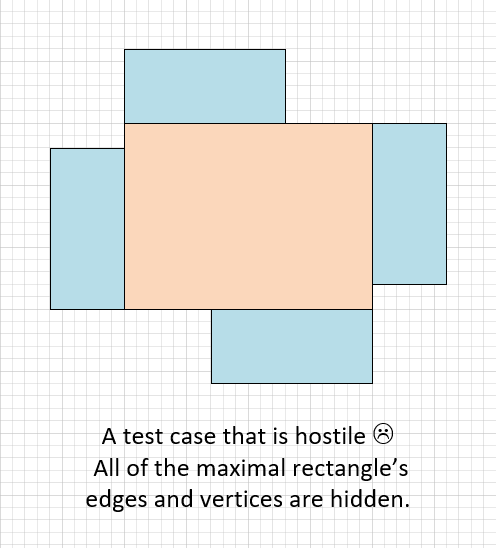
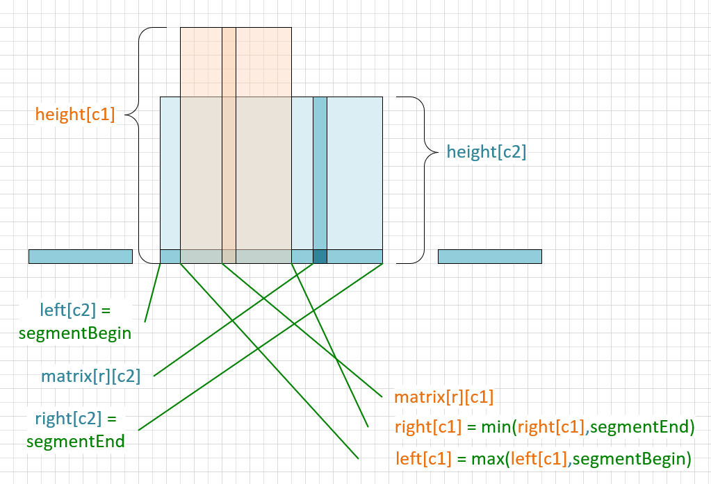

# 85. Maximal Rectangle

[Problem Description](https://leetcode.com/problems/maximal-rectangle/)

Given a rows x cols binary matrix filled with 0's and 1's, find the largest rectangle containing only 1's and return its area.

## Surprise!

This test case is not just tricky, it's hostile!

## Solution #2 Concept Illustration

Notice that although point matrix\[r]\[c1] is also contained by the light-blue rectangle,
it actually determines the light-pink rectangle.