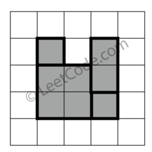
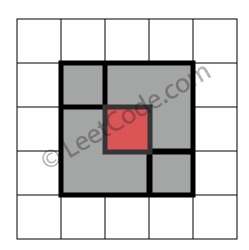
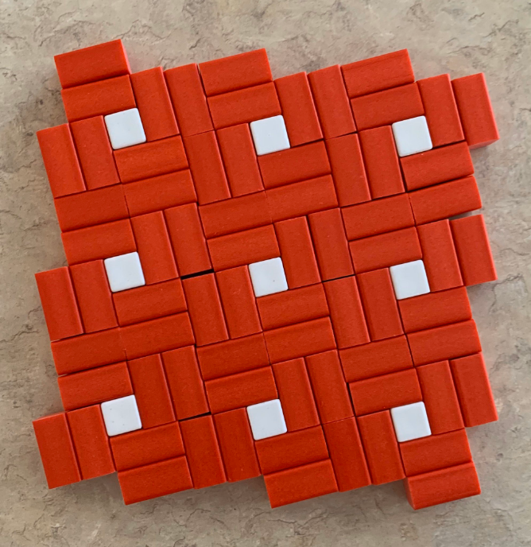

# Perfect Rectangle

[Problem description](https://leetcode.com/problems/perfect-rectangle/)

This is an extremely hard problem for me.

I encountered it four years ago. It was my impression that this problem was
absurdly hard because
- I kept getting Time Limit Exceeded error;
- Someone's solution looked like a magic to me then.

This time, I decided to tackle it for good.

Yesterday, it took me a whole day to design an algorithm, implement it with some effort, and optimize it with x10 more effort.
In the end, it was fast enough, except that it was wrong, due to an oversight of the nature of problem.

Even though I have solved it with another idea now, I had a hard time designing the program and debugging it this morning.

It's not easy to get a working idea if you haven't tackled this sort of problems before.

It's even harder to implement the idea correctly, i.e., take care of all corner cases (unit tests help a lot.)

This pattern killed my first idea:

(source: https://www.geogebra.org/m/z3skhnf6)

